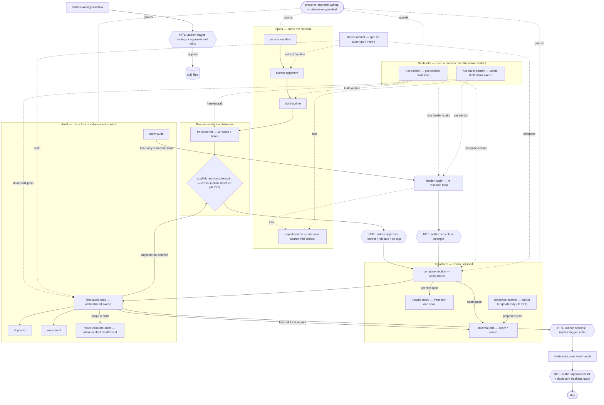

# Skill Graph

The directed flow of the writing-assistant skill stack, with explicit
human-in-the-loop (HITL) gates. Complements `skill-router.md` (which says *which*
skill when); this says *what flows into what* and *where the human is required or
optional*. `preserve-authorial-writing` is the always-on guardrail around every
node — it is not a step.

## Human-in-the-loop gates (the boxes above)

| Gate | Where | Required? |
| --- | --- | --- |
| **Risk-tier gate (cross-cutting)** | every skill | **Required for high-risk**: low-risk applies silently; medium is proposed; high (reorder, claim-strength, terminology, added interpretation/examples/citations, scope/audience/conclusion) **asks first**. This is the primary HITL mechanism; the named gates below are its concrete instances. |
| H1 architecture | after `scaffold-architecture-audit` | Required — reorder/relocate/de-dup are structural (med/high-risk); the audit proposes, the author decides. |
| H3 claim strength | inside `harden-claim` | Required — the loop produces honest evidence; the author sets the final claim strength. |
| H4 finalize | `finalize-document-with-audit` | Required — author approves final wording/claims + disclosure; confidential-leakage gate before ship. |
| H5 skillset | `harden-writing-workflow` (and `hardening-contract.md` for a multi-session pass) | Required — author triages findings + approves skill edits (e.g. the recurrence-registry checkpoint). |
| H2 audit acceptance | after `slop-scan` / `claim-audit` / `voice-audit` / `voice-costume-audit` | Optional-to-required — low-risk repairs apply; flagged medium/high items and every whole-artifact persona repair route to the author. In-band markers (`[CLAIM RISK]`, `[AUTHOR DECISION]`, `[EVIDENCE NEEDED]`, `[VERIFY CITATION]`, `[MECHANISM?]`) also route to the author. |

In-band human handoffs: the markers above are the optional-path-to-human at any
node — the assistant surfaces a decision rather than resolving it silently.

An autonomous demo may record a **simulated** gate decision to exercise the
workflow, but the gate remains open: simulated H1-H5 calls are not author
approval and cannot advance an artifact to `ship`.

## Edges (plain text, for non-rendering readers)

- Inputs: `source-manifest → extract-argument → build-outline`; `ingest-source` brings one new source into the record mid-project.
- Raw + architecture: `build-outline → frankendraft → scaffold-architecture-audit → [H1] → compose-section`.
- Transform: `compose-section → rewrite-block` (per raw span); `compose-section → minimal-edit` (seam pass); `condense-section → minimal-edit` (proposed cuts, author-gated).
- Audit: `compose-section → final-audit-pass → [H2] → finalize-document-with-audit → [H4] → ship`. `final-audit-pass` orchestrates `slop-scan` + `voice-audit`; a raw-scaffold-only `scaffold-architecture-audit` when that input is supplied; `minimal-edit` for eligible local repairs; and the finished-prose seam check. For whole drafts it also runs a mandatory blind-then-reveal `voice-costume-audit` and preserves its full verification record. `finalize-document-with-audit` runs `claim-audit` + `voice-audit` at closeout. Run the leaf audits directly for a single targeted check.
- Evidence loop: `claim-audit → harden-claim → [H3] → compose-section` (re-research a thin claim); `harden-claim → ingest-source` folds verified evidence to the ledgers.
- Runbooks (orchestrate the above over the whole artifact): `run-section` drives `build-outline → frankendraft → compose-section → final-audit-pass → minimal-edit → late harden-claim → fold`; `run-claim-harden` sweeps every section's claims via `harden-claim` and folds via `ingest-source`.
- Derived artifact: `derive-artifact → {extract-argument, build-outline, compose-section, final-audit-pass}` (spin an exec summary / memo off a finished dossier; re-asserts hardened claim strengths, invents nothing). Parallel register renderings of one raw source branch separately from the shared frankendraft; they do not route through one another.
- Meta: `harden-writing-workflow → [H5] → skill files` (improve the stack after sessions).

## Boundary edges that prevent overlap

- redundancy: phrase/paragraph-local → `slop-scan`; cross-section → `scaffold-architecture-audit`.
- claims: audit written prose → `claim-audit`; re-research a thin claim → `harden-claim`.
- voice: passage-level fidelity → `voice-audit`; cumulative whole-artifact persona → `voice-costume-audit`.
- generating: one raw span → `rewrite-block`; a whole section → `compose-section`; finished prose → `minimal-edit`; verbatim-only substrate → `frankendraft`.
